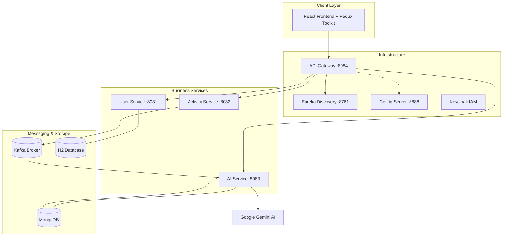

# FitPulse AI - Production-Grade Fitness Ecosystem

FitPulse is a modern, high-performance microservices-based fitness tracking platform. It leverages Spring Boot, Kafka, and Google Gemini AI to provide users with personalized, data-driven health recommendations based on their tracked activities.

---

## 🏗️ System Architecture

The project follows a distributed microservices architecture designed for scalability and resilience.



---

## 🚀 Key Features

- **Microservices Orchestration**: Automated service discovery and centralized configuration.
- **Event-Driven Analysis**: Real-time activity processing using Kafka brokers.
- **AI-Powered Insights**: Personalized recommendations generated by Google Gemini LLM.
- **Unified Gateway**: Single entry point with integrated OAuth2/OIDC security.
- **Reactive Frontend**: Modern React UI with Redux Toolkit for state management and Material UI for aesthetics.

---

## 🛠️ Technology Stack

| Layer | Technologies |
| :--- | :--- |
| **Backend** | Spring Boot, Spring Cloud, Spring Security |
| **Frontend** | React, Redux Toolkit, Vite, Material UI |
| **Messaging** | Apache Kafka |
| **Database** | MongoDB (NoSQL), H2 (Development SQL) |
| **AI** | Google Gemini (External LLM) |
| **Security** | Keycloak, JWT, OAuth2 |
| **Discovery** | Netflix Eureka |

---

## 📦 Service Breakdown

### 1. ⚙️ Config Server (Port: 8888)
Provides centralized configuration for all microservices using a native file system backend.
- **Config Path:** `classpath:/config`

### 2. 🔍 Eureka Server (Port: 8761)
Acts as the Service Registry, allowing microservices to discover each other dynamically without hardcoded URLs.

### 3. 🛡️ API Gateway (Port: 8084)
The face of the backend. Handles routing, load balancing, and cross-cutting concerns like security.
- **Security:** Integrated with Keycloak for JWT-based auth.

### 4. 👤 User Service (Port: 8081)
Manages user profiles and registration.
- **DB:** H2 Database (In-memory/Local File).

### 5. 🏃 Activity Service (Port: 8082)
The core engine for tracking sessions.
- **Flow:** Saves activity to MongoDB -> Publishes event to Kafka `activity-events`.
- **DB:** MongoDB (Collection: `activities`).

### 6. 🤖 AI Service (Port: 8083)
The intelligence layer.
- **Flow:** Consumes from Kafka -> Sends payload to Google Gemini -> Parses response -> Saves Recommendation to MongoDB.
- **DB:** MongoDB (Collection: `recommendations`).

---

## 📡 Messaging Flow (Kafka)

1. **Producer:** `Activity Service` tracks a new workout and publishes a JSON payload to the `activity-events` topic.
2. **Broker:** Kafka ensures the message is durable and delivered.
3. **Consumer:** `AI Service` receives the message, prepares a prompt for the Gemini LLM, and retrieves professional fitness advice.

---

## 📑 API Endpoints

### User Service
| Method | Endpoint | Description |
| :--- | :--- | :--- |
| `POST` | `/api/users/register` | Register a new user |
| `GET` | `/api/users/{userId}` | Get user profile details |
| `GET` | `/api/users/{userId}/validate` | Internal validation check |

### Activity Service
| Method | Endpoint | Description |
| :--- | :--- | :--- |
| `POST` | `/api/activites` | Track a fitness activity |
| `GET` | `/api/activites/{id}` | Get specific activity details |

### AI Service
| Method | Endpoint | Description |
| :--- | :--- | :--- |
| `GET` | `/api/recommendations/user/{userId}` | Fetch all AI tips for a user |
| `GET` | `/api/recommendations/activity/{id}`| Fetch tip for a specific activity |

---

## 🛠️ Setup & Installation

### Prerequisites
- JDK 17+
- Node.js & npm
- MongoDB (Running on `localhost:27017`)
- Apache Kafka (Running on `localhost:9092`)
- Keycloak (Running on `localhost:8181`)

### 1. Clone & Configure
```bash
git clone <repo-url>
cd fitness-microservices
```
*Ensure you have a Google Gemini API Key configured in the AI service properties.*

### 2. Start Services (Order Matters)
1. **Config Server**
2. **Eureka Server**
3. **Infrastructure** (Kafka, MongoDB, Keycloak)
4. **Business Services** (User, Activity, AI)
5. **API Gateway**

### 3. Frontend Setup
```bash
cd fitness-frontend
npm install
npm run dev
```

---

## 🛡️ Security Note
This project uses **OAuth2 with PKCE** for secure frontend communication. Ensure your Keycloak realm is configured with the `fitness-app` client ID and appropriate redirect URIs.
